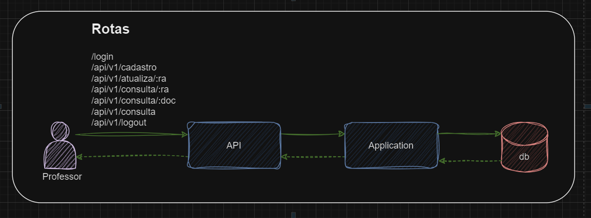
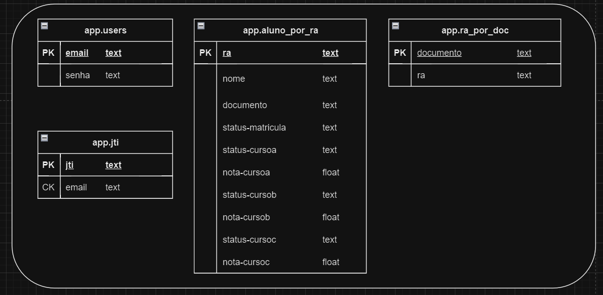

🚧🚧🚧🚧 EM CONSTRUÇÃO 🚧🚧🚧🚧

### Desafio - Dockerização

O objetivo deste desafio é criar um sistema seguindo o padrão de aquitetura Hexagonal (Ports and Adapters).
O sistema deve permitir aos usuários, como professores e administradores, gerenciar informações sobre alunos, cursos, notas.

### Arquitetura






### Testes Unitários

TODO: Usar SonarCloud 

### Testes de carga

TODO: K6

### Executando a aplicação

- Na pasta raiz do projeto subir a infraestrutura com ```docker compose up -d```
- Subir aplicação com ```docker run --rm -it -v %cd%:/work -w /work -p 3010:3010 --env-file=./src/.env clojure bash``` e em seguida ```lein run```.

Rotas na API

POSTMAN
- POST - http://localhost:3010/login (Vai gerar um token 'Bearer Token' e usar nas próximas requisições ) <p>
    Body ; x-www-form-urlencoded <p>
    
    login : admin@exemplo.com <p>
    senha : senhaAdmin

- POST - http://localhost:3010/api/v1/cadastro <p>
    Body ; x-www-form-urlencoded <p>
    nome : Nome <p>
    documento : 12345678900 (11 digitos)

- POST - http://localhost:3010/api/v1/atualiza/RA00065538 <p>
    Body ; raw (JSON)
    ```
    {
    "nome": "Nome",
    "status_cursoc": "matriculado",
    "nota_cursoa": 2.0,
    "status_cursob": null,
    "nota_cursob": null,
    "status_cursoa": "reprovado",
    "ra": "RA00065538",
    "status_matricula": "ativo",
    "nota_cursoc": null
    }
    ```
- GET - http://localhost:3010/api/v1/consulta/RA00065538 <p>
    Body ; none

- GET - http://localhost:3010/api/v1/consulta <p>
    Body ; none

- POST - http://localhost:3010/api/v1/logout <p>
    Body ; none