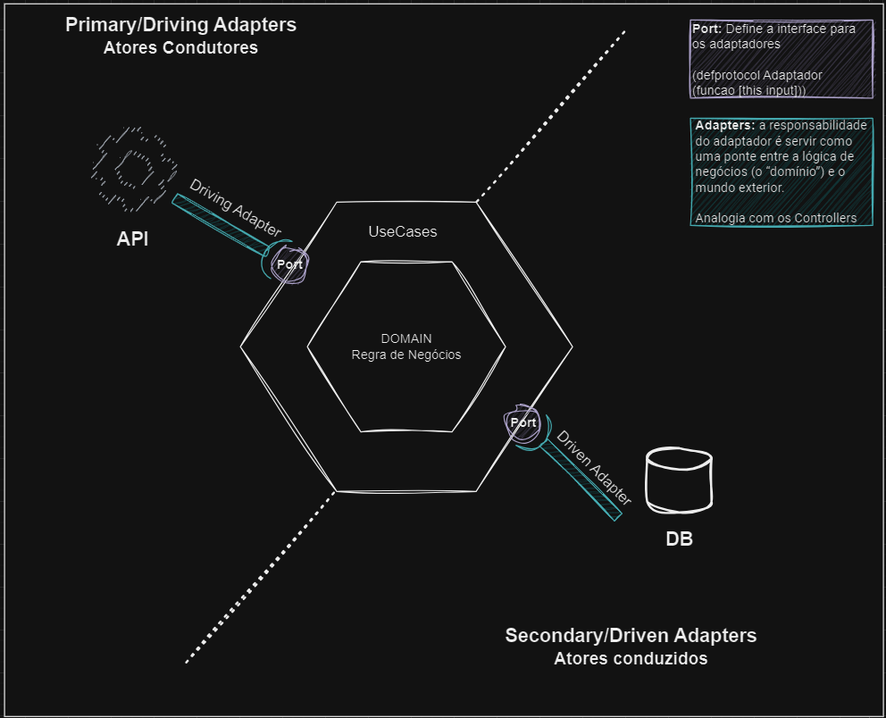

🚧🚧🚧🚧 EM CONSTRUÇÃO 🚧🚧🚧🚧

### Desafio - Dockerização

O objetivo deste desafio é criar um sistema seguindo o padrão de aquitetura Hexagonal (Ports and Adapters).
O sistema deve permitir aos usuários, como professores e administradores, gerenciar informações sobre alunos, cursos, notas, horários de aula e matrículas.

### Arquitetura

### Testes Unitários

TODO: Usar SonarCloud 

### Testes de carga

TODO: K6

### Executando a aplicação

